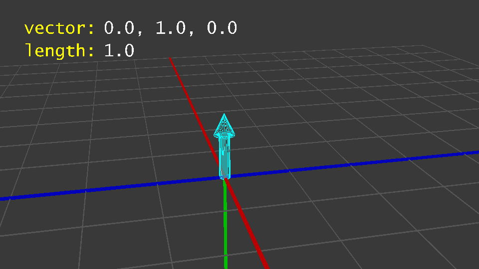
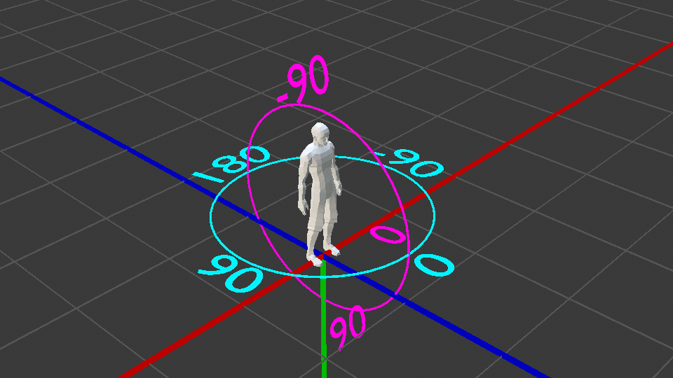

# Vectors

Vectors are extremely useful tools when working with things in 3d space, whether you need offsets, angles, velocity, and more. They're most commonly used in Skript when working with velocities and particles, but vectors can do a lot more than just that.

They can be a bit tricky to wrap your head around, so we'll start small and build up from there. This page contains an introduction to the concept of vectors and will be followed by pages about how vectors are used in Skript, specifically.


**We highly recommend not skipping sections of this tutorial.**

&#x20;Terms and concepts tend to build off of previous ones, and if you skip ahead you may find yourself a little lost and confused.

That said, if you understand the basics of what a vector is, feel free to skip to [Vectors in Skript](vectors-in-skript/).


***

## What is a Vector?


A vector is a quantity with a magnitude and a direction.


&#x20;Doesn't that clear everything up?

While at first that definition feels vague and unhelpful, that's because the concept of a vector is very broad and can be used in many ways. We need to narrow our definition a bit in order to get something that's useful to use.

To begin with, let's clarify what kind of "space" we're working in. In Minecraft, similar to real life, we most often work with a 3D space. We have X, Y, and Z axis that define our world, our coordinates. However, we're going to begin by looking at just a 1D space to introduce vectors, and work our way up to 3D.

***

## 1 Dimensional Vectors

<figure><figcaption><p>A number line with 3 vectors on it.</p></figcaption></figure>

Here's a number line with a few vectors. Our one dimensional space. You can go right (positive) or left (negative). One line, one dimension, simple.

This number line displays 3 vectors. The blue vector is pointing in the positive direction and travels 7 units in that direction. We can write this vector as `7`. Likewise, the green vector will be `-4` and the red vector is `2`.


In one dimension, vectors are just numbers.

The sign of the number (negative/positive) is the direction.

The number itself (1, 2, 5, 9, ...) is the magnitude, or length.


### 1D Vector Arithmetic

If we run with this concept, we can start adding and subtracting vectors, too!

When we add vectors, we take the "tail" of one vector and put it at the "tip" of another. This is because vectors don't really care where they start. Vectors care about **differences**. The red vector, no matter where it starts, always point 2 units in the positive direction.

<figure><figcaption><p>Vector addition of <code>7 + 2 - 15 = -6</code></p></figcaption></figure>

Above, you can see 3 vectors being added together. We start with the blue `7`, going 7 units in the positive direction. Then we add the red `2`, going 2 more units. At this point, we could stop and end with a vector going 9 units to the right, or `9`. Above, though, we add a very big green vector, `-15`. This takes us left, because it's negative, all the way back to `-6`.

So to sum up our grade school math class, `7 + 2 + -15 = -6`. Remember, the sign of a number controls what direction we point in, so we could also imagine the green vector to actually be `15`, pointing right, but we're subtracting it instead (`7 + 2 - 15 = 6`).


Adding vectors is as simple as putting them "tip to tail", or adding up their component parts.

Subtracting vectors is the same, but you have to flip the vector around before putting them tip to tail. This is the same as subtracting their component parts.


We can also multiply and divide vectors by each other. This is simple when you're in 1D, it's just making the vector longer or shorter. In 2D and 3D, it's a bit more complicated, so we'll touch on that later.

***

## 2 Dimensional Vectors

Now things get a bit more interesting. With two dimensions, we have a whole plane to play around in:

<figure><figcaption><p>A 2D plane with some basic vectors</p></figcaption></figure>

Essentially, we now have 2 number lines, one horizontal and one vertical, and we can draw 1 dimensional vectors along both. Unfortunately, we now have to distinguish between horizontal and vertical.&#x20;

As I'm sure most of you know, we generally consider the horizontal axis to be the x-axis and the vertical one to be the y-axis, so we can say the green vector travels 5 units in the positive x direction and 0 units in the y direction, which we'll denote as `(5, 0)`. Likewise, the blue and red vectors would be `(0, 3)` and `(0, -4)` respectively.

This way of denoting vectors is extremely useful once we start moving into true 2D and 3D vectors. `(0, 3)` means 0 X movement and 3 units of Y movement, which is basically two 1D vectors. A 0 length vector in X, and a 3 length vector in Y.

I'm sure you can guess what comes next. Let's see a (`3, 4)` vector.

<figure><figcaption><p>A 2D vector made up of two 1D vectors.</p></figcaption></figure>

The blue vector is our `(3, 4)` vector, while the red and green vectors are what we call the **component parts** of our vector. Green is `(3, 0)` and red is `(0, 4)`, which obviously add together to make the blue vector.


Vectors act the same in 2D as 1D. You still add tip to tail, you still have a direction and a magnitude, but we keep track of 2 numbers, the X and the Y.


This form is great, because we can easily add or multiply vectors.

```
(1, 2) + (3, 4) = (1 + 3, 2 + 4) = (4, 6)

(1, 2) * (3, 4) = (1 * 3, 2 * 4) = (3, 8)
```

However, it's rather annoying if we want to change the length or direction of our vector.

### 2D Length and Direction

Now, calling our vector `(3, 4)` makes it really easy to understand the component parts, the x and the y, but we don't know how long our vector is or the exact direction it's pointing in. For that, we'll need a bit more math.

Length is pretty simple. We can simply use the Pythagorean theorem, because essentially all we have is a right triangle. We take the length of green squared and the length of red squared, take the square root, and voila: the length of blue!

```
sqrt( x^2 + y^2 ) = length

sqrt( 3^2 + 4^2 ) = sqrt( 25 ) = 5 
```


&#x20;This is also called the "distance formula", and will show up again in 3D.


Direction is more complicated. I won't get into the math here, but it involves trigonometry. Basically, we'll use a compass to guide us. Pointing right (+x) will be 0 degrees, up (+y) is 90, left is 180, and down is 270, or -90.&#x20;

Our green vector is 0 degrees, the red vector is 90, and our blue vector is a very nice 53.13 degrees.

<figure><figcaption><p>A 2D vector with length and angle annotated</p></figcaption></figure>

So now we have a second way to describe our vector: `5 ∠53.13°`, meaning a length of 5 with an angle of 53.13 degrees. In math, these are often called **polar coordinates**.


In 2D, there are now two ways to write a vector:

1. Write the X and Y components together: `(x,y)`. Useful for addition and multiplication.
2. Write the length and the direction in degrees of the vector: `length ∠angle°`. Useful for lengthening/shortening and rotating the vector.


***

## 3 Dimensional Vectors

Finally, to the good stuff! As I'm sure you have guessed by now, all we have to do to go from 2D to 3D is add a third number line, which will be called Z. Now, our vectors will look like `(x, y, z)` which I'm certain is familiar to anyone who has played Minecraft.


Computing length, like in 2D, involves the distance formula:

```
sqrt( x^2 + y^2 + z^2 ) = length
```



In the above gif, you can see how the changes to the X, Y, and Z components of a vector affect its length. You can also see the direction changing, but like in 2D, it's pretty tricky to calculate. Since this is a Skript tutorial, and Skript does the math for you behind the scenes, we'll skip it like we did for 2D.

### Yaw and Pitch

Calculation aside, we need some way to describe the direction a vector points in. We can start with our compass idea from back in 2D. In general, this "compass" is called the **yaw**. It tells you the horizontal direction the vector is pointing. But for 3D, we need vertical direction too.&#x20;

This is where **pitch** comes in. This is the same idea, but it's the angle for how far up/down the vector is pointing. You can see a diagram below, where yaw is blue and pitch is pink.&#x20;



You can view your own yaw and pitch in Minecraft via the F3 menu. Try looking around and seeing how the numbers change.

Yaw and pitch let us describe a 3D vector. We still use length and yaw just like we did for 2D, but we add in pitch. Here's an example:

```
In XYZ: (3, -2, 1)

Length: sqrt( 9 + 4 + 1 ) = sqrt( 14 ) = 3.74
Yaw: 288.4 degrees
Pitch: 32.3 degrees

(3.74, ∠288.4, ∠32.3)
```

And remember, everything that worked for 1D and 2D still works here. We can still add, subtract, multiply, and otherwise change our 3D vector in much the same ways.

***

## What is a Vector?

So what did we learn? A vector is indeed something with magnitude and direction, but it really depends on how many dimensions you're talking about. We care about 3D vectors, because Minecraft is 3D. From now on, any time we reference "vector", it means a 3D vector.

We learned that you can write a vector as its 3 component parts, X, Y, and Z. This form turned out to be great for arithmetic like adding and multiplying, but really confusing for length and rotation.

We learned about yaw and pitch, and how we can also write a vector as a length combined with two angles, one for horizontal direction and one for vertical direction. This form is really bad for arithmetic, but really easy to rotate or lengthen.

We also learned, most critically, that **vectors don't really care where they start**. As long as you have some starting spot, a vector will always move you in the same direction, by the same amount. It's just like adding 5 to any number. You always move 5 in the positive direction, no matter if you start at -1 or 27.

So, with the basic concept of a vector in our heads, let's get back to Skript! Head to the next page.
